# Miqat — macOS Prayer Times App

> *Miqat (ميقات) — the appointed time and place. In Islamic tradition, the point from which the journey begins.*

A full native macOS prayer times app built for Muslims who live at their Mac. Always visible in the menu bar, a beautiful floating desktop widget, and a full app window — all running together, all in sync.

**No backend. No account. Fully local. Fully offline.**

---

## Three Surfaces, One App

### Menu Bar — Always There
The menu bar shows your next prayer and a live countdown at all times. It turns orange when you have 30 minutes left, red when under 20. Click it to open the full popover with all prayer times, your streak, and quick settings.

### Floating Widget — Always on Desktop
A beautiful floating panel that lives on your desktop. Drag it anywhere, resize it between small, medium, and large. The gradient background shifts with the time of day — deep navy at Fajr, amber at Asr, deep orange into purple at Maghrib. It never hides behind your windows.

### Full App Window — When You Need More
Open from the Dock or menu bar for the full picture: today's prayers, monthly calendar, tracker grid, stats charts, notifications config, location management, and all settings.

---

## Screenshots

### Home — Today's Prayers
Live countdown to the next prayer with an I Prayed button. Streak and daily summary at a glance.

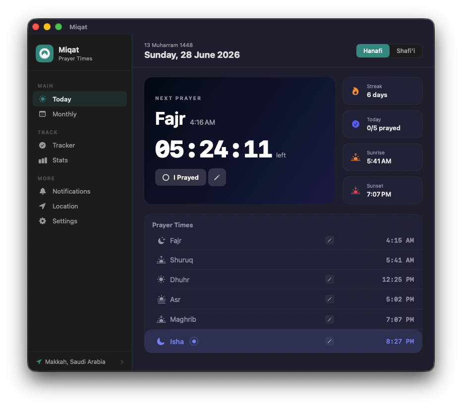

### Monthly Calendar
Browse any month and see prayer times for any day. Hijri date shown throughout.

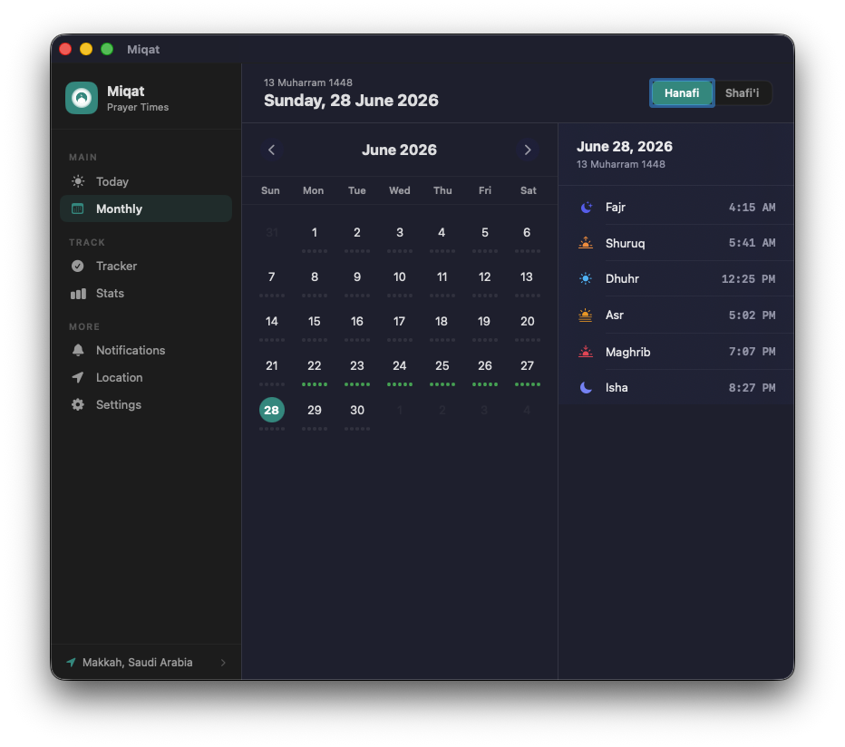

### Prayer Tracker
Weekly grid showing which prayers you prayed or missed. Completion %, this week count, best streak, current streak.

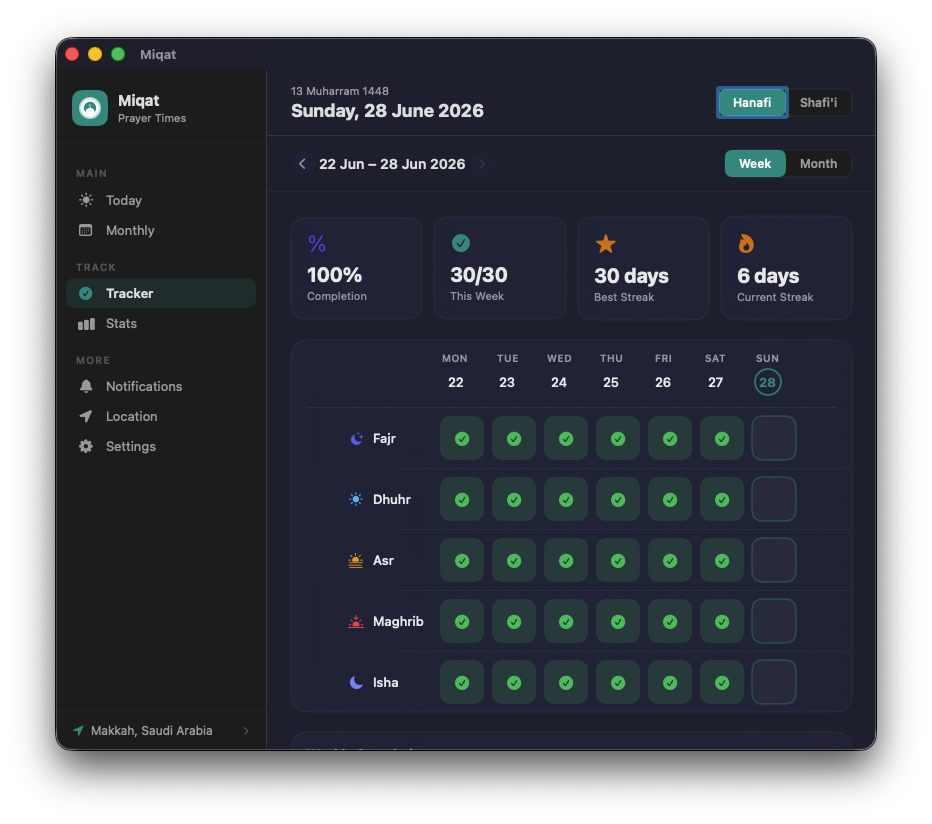

### Stats & Overview
Bar chart of daily completions, per-prayer breakdown, week/month/year views.

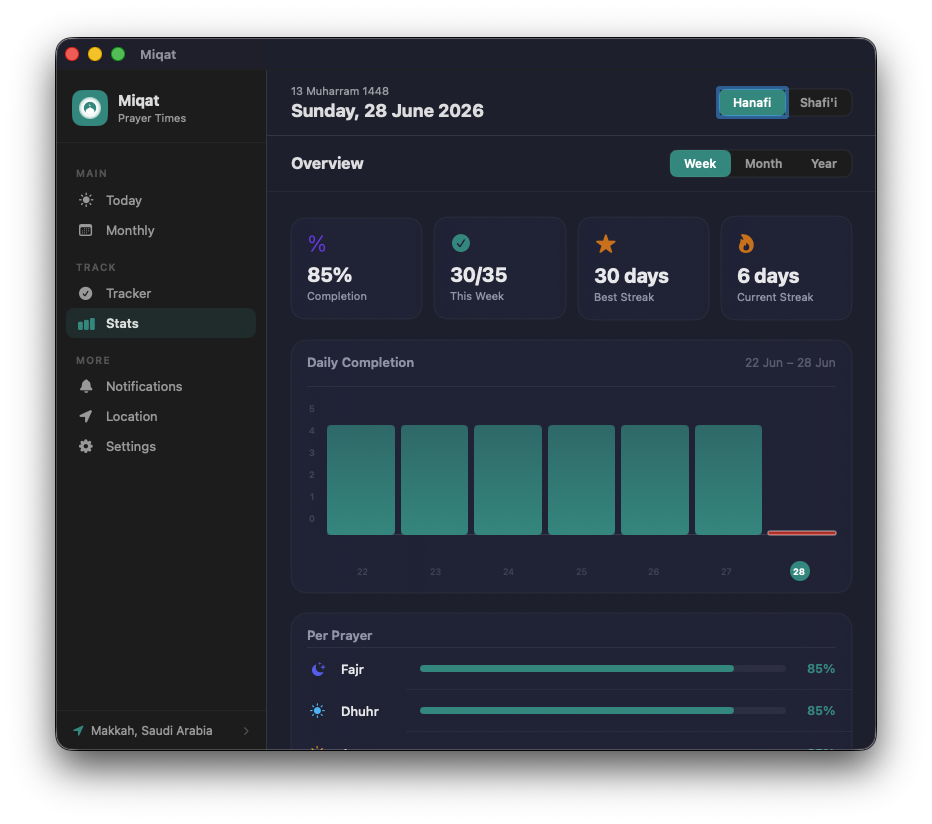

### Notifications
Configure reminders per prayer — how many minutes early, alert at prayer time, and a Jamaat reminder. Friday Jumu'ah and Surah Mulk/Kahf reminders built in.

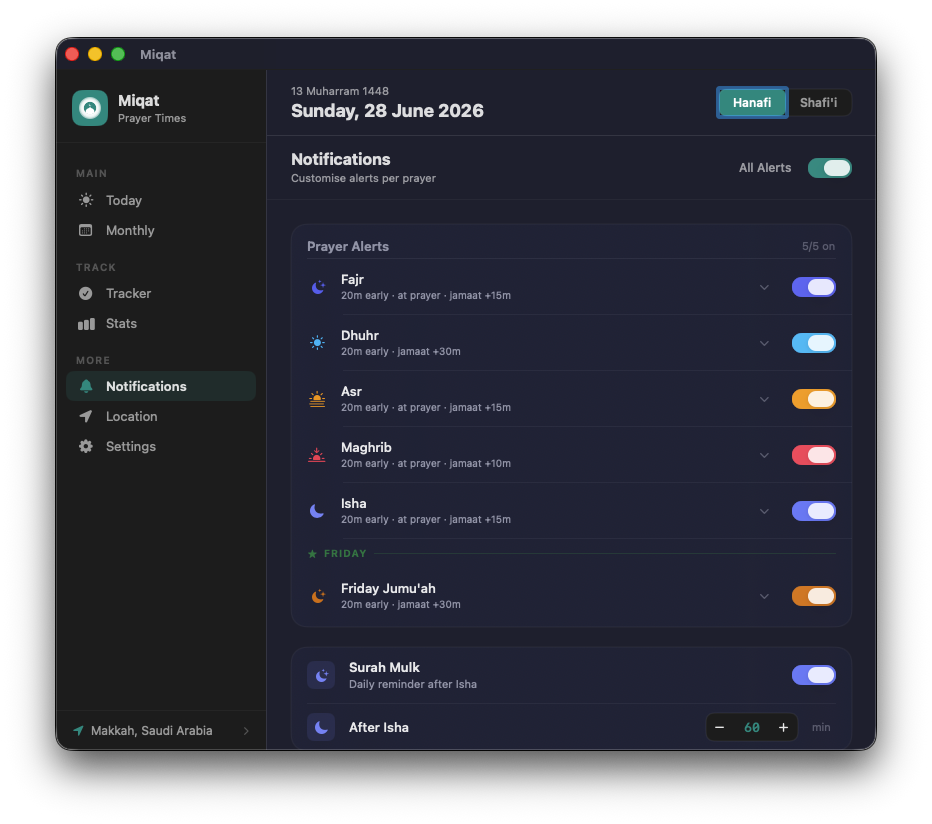

### Location
Pick from preset cities (Makkah, Madinah, Karachi), detect via GPS, or search any city worldwide. Multiple saved locations supported.

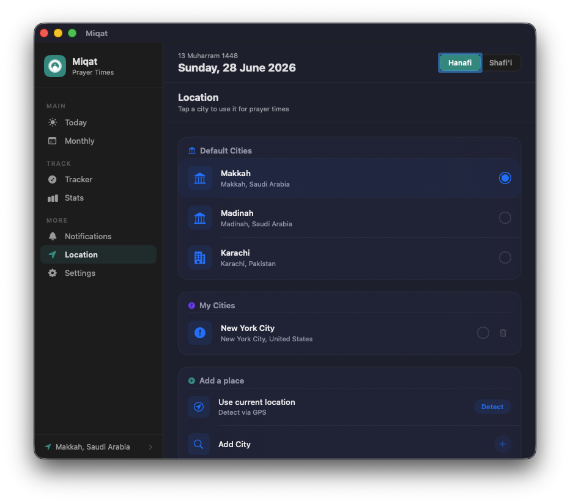

### Settings
Calculation method, Madhab (Hanafi / Shafi'i), High Latitude rule, and manual minute adjustments per prayer.

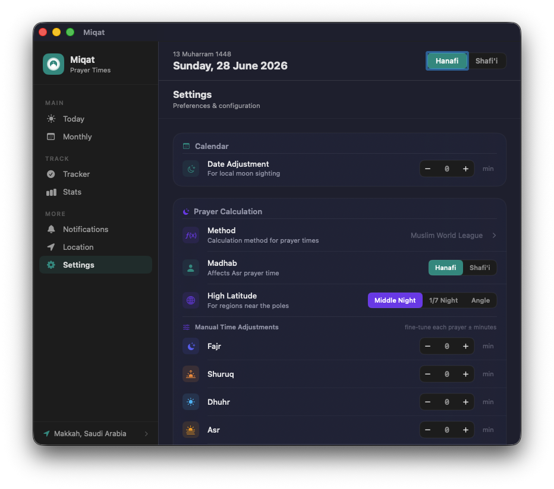

### Desktop Widget — Large
Full prayer list, live countdown, I Prayed button, streak pill, and open-app shortcut. All on your desktop at all times.

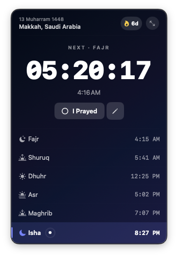

### Desktop Widget — Context Menu
Right-click the widget to switch mode (Off / Normal / Always), resize it, change Madhab, or change location without opening the app.

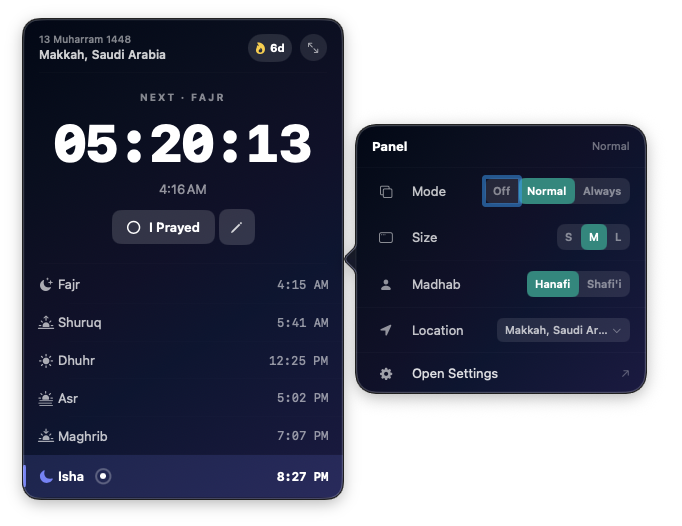

### Menu Bar Popup
Click the menu bar to see all prayers, your streak, Madhab toggle, and location — without opening the main window.

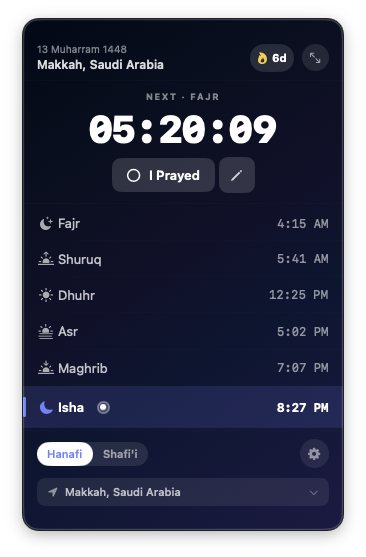

### Desktop Widget — Small
Minimal mode: just the countdown and a quick-mark button. Stays out of the way.

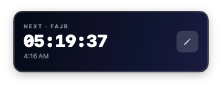

---

## Features

**Prayer Times**
- Accurate times via [Adhan-Swift](https://github.com/batoulapps/adhan-swift)
- Multiple calculation methods: Muslim World League, ISNA, Egypt, Karachi, Umm Al-Qura, Gulf, and more
- Hanafi and Shafi'i Madhab for Asr
- High latitude support: Middle Night, 1/7 Night, Angle-based
- Manual minute adjustments per prayer
- Hijri calendar date shown throughout

**Tracker & Stats**
- Mark any prayer as prayed with one click
- Streak tracking — current and best streak
- Weekly, monthly, and yearly stats
- Completion rate and per-prayer breakdown
- Tracker grid view (week) with missed/prayed/upcoming indicators

**Notifications**
- Configurable reminder X minutes before each prayer (5–60 min)
- Alert at prayer time
- Jamaat reminder (configurable minutes after prayer starts)
- Friday Jumu'ah alerts with Khutbah reminder
- Surah Mulk reminder after Isha
- Surah Kahf reminder (Thursday night / Friday morning)
- Test any notification without waiting for the real time

**Widget**
- Always-on-desktop floating panel (NSPanel, never behind windows)
- Three sizes: small (countdown only), medium, large (full prayer list)
- Time-of-day gradient backgrounds — 6 distinct palettes
- Draggable, remembers position
- Context menu for quick settings without opening the app

**Location**
- Built-in presets: Makkah, Madinah, Karachi
- GPS auto-detect
- City search — any city worldwide
- Multiple saved locations, tap to switch

---

## Tech Stack

- Swift 5.9+, SwiftUI + AppKit, macOS 13+, Universal binary
- [Adhan-Swift](https://github.com/batoulapps/adhan-swift) — prayer calculation
- CoreLocation, UserNotifications, SwiftData
- No third-party UI frameworks

---

## Architecture

Clean Architecture with SwiftUI `@Observable`:

```
Model → Repository → ViewModel (@Observable) → View
```

All three surfaces (menu bar, widget, main window) share the same ViewModels through a `ServiceLocator`. No duplicated state.

```
Miqat/
  App/              — AppDelegate, entry point
  Features/
    Widget/         — floating NSPanel
    Popover/        — menu bar click popover
    MainWindow/     — full app window + all tabs
    PrayerEngine/   — Adhan-Swift wrapper, location
    Notifications/  — UNUserNotificationCenter
    Tracker/        — prayer history, streaks, stats
    Settings/       — preferences
  Core/
    Components/     — shared UI components
    Theme/          — colours, gradients
    Models/         — AppSettings, shared types
```

---

## Build

1. Clone the repo
2. Open `Miqat.xcodeproj` in Xcode 15+
3. Select your Mac as the run destination
4. Run — no setup needed, SPM resolves dependencies automatically

Requires macOS 13 Ventura or later.

---

## Contributing

Open source, free forever. PRs welcome. See [CONTRIBUTING.md](CONTRIBUTING.md) for guidelines.

---

## License

MIT — see [LICENSE](LICENSE)
